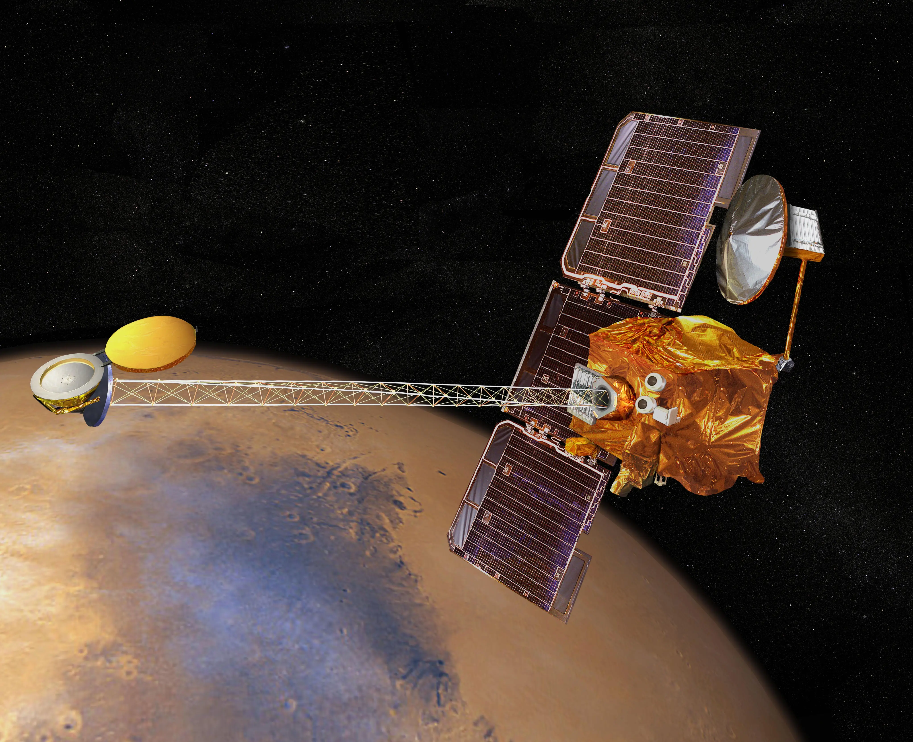

# GIS in Space
by Victoria Martinez

Below you will learn about some of the top missions set up by NASA using the help of advanced GIS technologies. From sending and recieving data from space, spatial analysis is conducted on various exoplanets' surfaces and helps scientists and engineers. This access to spatial data helps with space missions to study areas of the Moon's untouched surfaces and ranges to searching for the next habitable planet and with the help of some analysis can possibly lead to Mars.

## Top 4 Space Missions
- Blue Ghost Mission I
- Mars Reconnaissance Orbiter
- Landsat 9
- Mars Odyssey

## Blue Ghost Mission I

*"Firefly's Blue Ghost Lander" credits to NASA*

NASA is developing a series of lunar deliveries and Firefly's Blue Ghost Lander will help mark the beginnings of controlled human existence on the Moon. The lander will be on the Moon for 14 days studying the intricate subsurface up to 700 miles deep. By exploring an untouched area of the moon, using magnetotellurics will help conduct analysis on surface and magnetic fields of Moon surface materials helping define their compositions.

### Lunar Magnetotelluric Sounder
The LMS is the given name of the device that will help NASA explore the 350 mile wide basin, Mare Crisium, which is a large spot on the Moon visible from Earth. Since the Apollo missions were conducted West of the basin, the structure of the Moon is yet to be configured by the LMS which will be done so by recording the Moon's geophysical measurements. These will help determine closer results to the actual composition of the entire Moon.

## Mars Reconnaissance Orbiter

*"Mars Reconnaissance Orbiter" credits to NASA*

Data collected by the Mars Resonnaissance helps various engineers and scientists focused on Mars to find areas that can most likelt be future landing sites. It is part of the missions that have been set to meet the Mars Exploration Program which focus on past Mars life, current Mars climate shifts, the interior and exterior of Mars and its possibility to harbor human life. In its span of existence the spacecraft has orbited and analyzed Mars from 2006-2014 while aiding the Mars Science Lab and the Mars Exploration Rovers.

### Objectives for the Mars Reconnaissance Orbiter
1. Gather climate patterns of Mars while understanding seasonal changes

2. Conclude surface terrain on Mars and indetify any past or present trace of water

3. Search in areas where aqueous/hydrothermal activity is present

4. Find areas with strong signs of landed science for sampling

5. Return data from Mars to scientists 

## Landsat 9

*"Landsat 9" credits to NASA*

Launched in California in 2021, the Landsat 9 was launched in collaboration by NASA and USGS (U.S.Geological Survey) to monitor, track and understand resources on Earth that are required to sustain our lives. As humans we havve taken over large portions of land use and have ultimately driven climate induced issues onto our planet. Landsat 9 is the **only** U.S. satellite system that has been set out to orbit and record both natural and human driven issues. It works alongside Lansat 8 which works at a fast rate for capturing data and can now retire the use of Landsat 7 due to its slower capabilities.
### Landsat Facts
 - Design was built to live for 5 years
 - Captures about 700 Images per day
 - 438 miles away from earth level
 - Travelling at 16,760 mph

## Mars Odyssey

*"Mars Odyssey" credits to NASA*

In 2001 the Mars Odyssey began to Orbit Mars and thanks to scientific and tehcnological advancements NASA was able to retreive spatial data of Mars' surface wihch was never seen by austronauts before. With the help of GIS, which is used for geographic Earth analysis, the mapping of exoplanets and other celestial bodies. This was made achieveable due to the abilities of converting data and images from rovers and sattelites into spatial data. 
### THEMIS (Thermal Emission Imaging System)
The THEMIS was a camera placed by NASA on the Odyssey to help map the surface of Mars as well as its thermal energy that is not visible to the human eye. With the THEMIS scientists were then able to draft a strikingly similar model of Mars and its geologic activity.

## See also
### The Power of GIS in Space
- [https://id.land/blog/the-power-of-gis-in-space](url)

### GIS at NASA
- [https://storymaps.arcgis.com/stories/1c45be14c6fd4522824be10e0f446cda](url)

### Present NASA Missions
- [https://www.nasa.gov/general/our-missions-present/](url)

### Finding the Best Paths for Rovers and Humans on Mars
- [https://www.esri.com/about/newsroom/arcuser/finding-the-best-paths-for-rovers-and-humans-on-mars/](url)

## References
1. NASA
2. Astronomy
3. GIS at NASA
4. ESRI