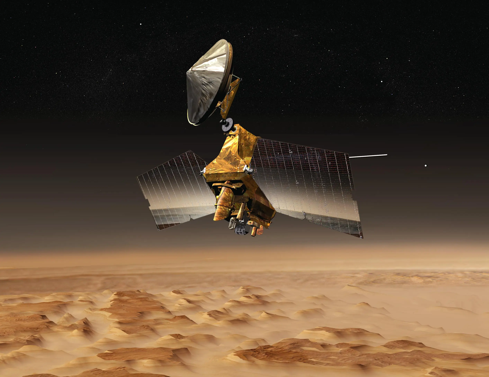

# GIS in NASA
Victoria Martinez

## Top 4 Space Missions

## Blue Ghost Mission I

NASA is developing a series of lunar deliveries and Firefly's Blue Ghost Lander will help mark the beginnings of controlled human existence on the Moon. The lander will be on the Moon for 14 days studying the intricate subsurface up to 700 miles deep. By exploring an untouched area of the moon, using magnetotellurics will help conduct analysis on surface and magnetic fields of Moon surface materials helping define their compositions.

### Lunar Magnetotelluric Sounder
The LMS is the given name of the device that will help NASA explore the 350 mile wide basin, Mare Crisium, which is a large spot on the Moon visible from Earth. Since the Apollo missions were conducted West of the basin, the structure of the Moon is yet to be configured by the LMS which will be done so by recording the Moon's geophysical measurements. These will help determine closer results to the actual composition of the entire Moon.

## Mars Reconnaissance Orbiter

Data collected by the Mars Resonnaissance helps various engineers and scientists focused on Mars to find areas that can most likelt be future landing sites. It is part of the missions that have been set to meet the Mars Exploration Program which focus on past Mars life, current Mars climate shifts, the interior and exterior of Mars and its possibility to harbor human life. In its span of existence the spacecraft has orbited and analyzed Mars from 2006-2014 while aiding the Mars Science Lab and the Mars Exploration Rovers.

### Objectives for the Mars Reconnaissance Orbiter
1.Gather climate patterns of Mars while understanding seasonal changes

2.Conclude surface terrain on Mars and indetify any past or present trace of water

3.Search in areas where aqueous/hydrothermal activity is present

4.Find areas with strong signs of landed science for sampling

5.Return data from Mars to scientists 

## Curiosity Rover (Mars Science Laboratory)

One or several paragraphs for subsection 3.
### (Optional) Subsection 1
One or several paragraphs

## Sentinel Missions

One or several paragraphs for subsection 3.
### (Optional) Subsection 1
One or several paragraphs

## See also
- [https://id.land/blog/the-power-of-gis-in-space](url)
- [https://storymaps.arcgis.com/stories/1c45be14c6fd4522824be10e0f446cda](url)
- [https://www.nasa.gov/general/our-missions-present/](url)

## References
1. NASA
2. Astronomy
3. GIS at NASA