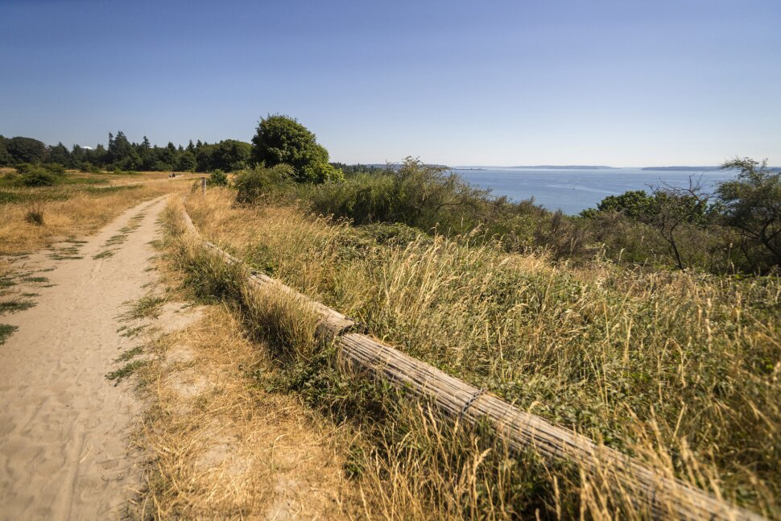

# Hiking in Seattle

Top 4 trails to see in Seattle, WA.

A short description on hiking trails / abstract of the topic you choose. For the text here and below, feel free to use **bold** and *italic* fonts, [linked texts](url),  , or any other element you think would be helpful for your audience to understand the topic.

## Burke Gilman Trail
One or several paragraphs.
### (Optional) Subsection 1
One or several paragraphs

## Rattlesnake Ledge
One or several paragraphs.
### (Optional) Subsection 1
One or several paragraphs.

## Washington Park Arboretum
One or several paragraphs for subsection 3.
### (Optional) Subsection 1
One or several paragraphs

## Arboretum Waterfront Trail
One or several paragraphs for subsection 3.
### (Optional) Subsection 1
One or several paragraphs

## See also
- [https://eatingtheave.com/](url)
- [https://udistrictseattle.com/blog/winter-indoor-activities](url)
- [https://www.tripadvisor.com/Attractions-g60878-Activities-zft11295-Seattle_Washington.html](url)

## References
1. Seattle Parks and Recreation
2. US News
3. All Trails 